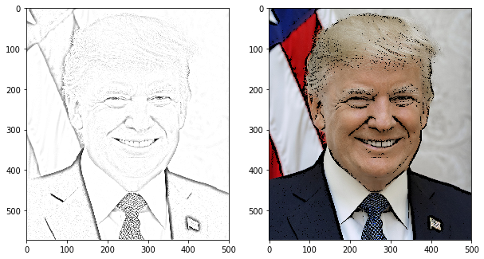

# Pencil Sketch Mini-project using edge detection and blurring with OpenCV

This mini project takes an image and tries to cartoonify the image.

I tried two approaches: 
- 1. Take the edge detection of the image and then apply the mask
    a) Take the image and convert it to grayscale.
    b) Blur the image using gaussian blur to remove noise
    c) Take the blurred image and apply the sobel edge detection.
    d) threshold the edges to make a mask and clip it to 0, 1
    e) apply mask to original image to get final result
    
    left(original), middle(mask), right(final_result)
- 2. Take the dodge + merge of the image and apply it over the mask
    a) Take the image and convert it to grayscale.
    b) make a 2nd copy of the grayscale, and bitwise not the copy(now _graynot)
    c) take the _graynot and blur it.
    d) perform the dodge+merge operation -> _dodgeimg = 255*_gray/(255-_graynot)
    e) clip _dodgeimg  to (0, 255).
    f) perform thresholding on the _dodgeimg to get a mask
    g) apply mask to original image to get final result
    
    left(dodge_merge result), right(final_result)
